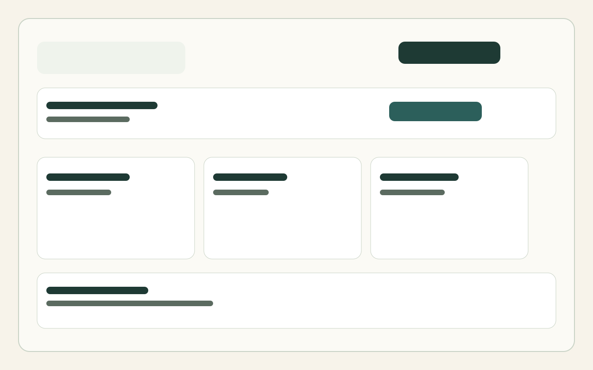
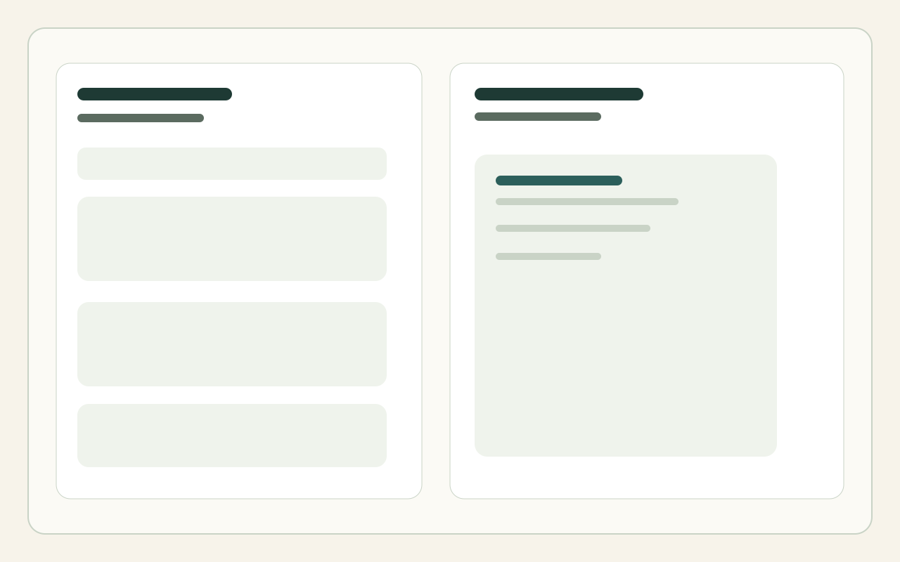

# Papertrail Resume
Papertrail Resume is a full-stack resume builder that helps users create, save, and download polished CVs through a guided multi-step experience.
## Features
- Guided 7-step resume builder
- Live preview while editing
- Save resume drafts and records
- Download resume output
- Modern dashboard for managing resumes
- Authentication-ready API structure
## Tech Stack

### Frontend

- React 19 + Vite
- TypeScript
- Tailwind CSS
- React Hook Form
- TanStack Query
- Lucide icons

### Backend

- FastAPI
- SQLAlchemy
- Pydantic
- Alembic
- PostgreSQL

## Project Structure

```text
CV-Maker/
├── backend/
│   ├── app/
│   │   ├── api/
│   │   ├── core/
│   │   ├── models/
│   │   ├── repositories/
│   │   ├── schemas/
│   │   └── services/
│   ├── alembic/
│   └── requirements.txt
├── frontend/
│   ├── src/
│   │   ├── components/
│   │   ├── context/
│   │   ├── hooks/
│   │   ├── pages/
│   │   ├── schemas/
│   │   └── services/
│   └── package.json
└── docs/
```

## Screenshots

Add your screenshots to the docs folder and update the image links below once you have them ready.




## Getting Started

### 1. Backend

```bash
cd backend
python -m venv venv
venv\Scripts\activate
pip install -r requirements.txt
```

Create a `.env` file and configure your database connection.

Run the API:

```bash
uvicorn app.main:app --reload
```

### 2. Frontend

```bash
cd frontend
npm install
npm run dev
```

Open http://localhost:5173

## API Docs

Once the backend is running, open:

- http://127.0.0.1:8000/docs

## Notes

This repository is ready to be pushed to GitHub. If you want, you can also add screenshots under the docs/images folder to make the README visually richer.
